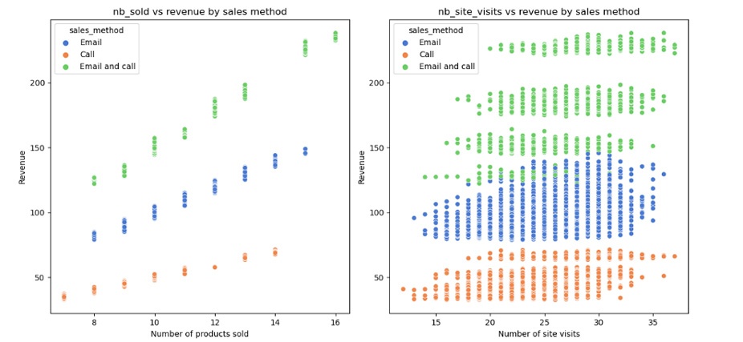

# DataCamp Certified Data Analyst Professional with Python

#### -- Project Status: [Active]

## Objective
This repository documents my progress through the Data Analyst Professional Certification at DataCamp, with a focus on Python. The certification involves two timed exams and a practical exam. During my preparation, I've had the opportunity to enhance my Python skills, covering everything from basic concepts to advanced data wrangling and manipulation techniques. I've also learned to create charts and graphs using popular visualization packages.

Currently, I'm engaged in the final part of the certification, which is the practical exam. In this exam, I am analyzing the effectiveness of three different sales strategies employed by "Pens and Printers" for their new stationery product line. The aim is to evaluate customer reach and revenue generation to determine the most effective sales approach for future product launches. Upon completion, I will create a video presentation to share my findings, insights, and recommendations with the sales team.

### Data Analyst with Python
* [Data Analyst with Python career track](https://www.datacamp.com/tracks/data-analyst-with-python)
  * Mastering the basics of data analysis using Python
  * Creating visualizations using Matplotlib and manipulating data with pandas
  * Data manipulation, cleaning, and statistical analysis with Python
  * Using Python libraries like Seaborn for data visualization
  * Exploratory data analysis (EDA) to extract insights from data
  * Hypothesis testing and sampling techniques in Python

### Data Analyst Professional Certification
* [Data Analyst Professional Certification](https://www.datacamp.com/certification/data-analyst)
  * Data management
  * Exploratory analysis
  * Analytics fundamentals
  * Data communication
  * Coding for production
  * Statistical experimentation

### Data and sources
* The data used belongs to [DataCamp](https://www.datacamp.com/)
